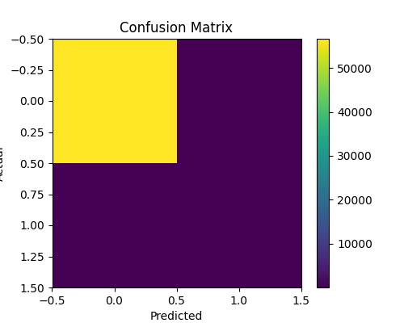
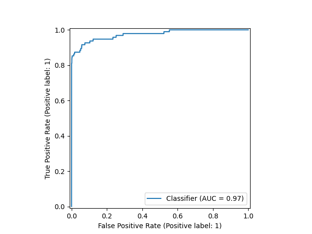

# 💳 Credit Card Fraud Detection

<div align="center">


**Real-time Credit Card Fraud Detection using Machine Learning**

[](/)
[](/)
[](/)
[](/)

</div>

---

## 📊 Overview

Real-time fraud detection system using **XGBoost Classifier** with comprehensive data preprocessing, feature engineering, and evaluation pipeline. Achieves excellent performance on highly imbalanced dataset.

### 🎯 Key Features

- ⚡ **High Performance**: 97.47% ROC-AUC score
- 🎯 **Low False Alarms**: 92.59% precision rate
- 📈 **Production Ready**: Single & batch prediction API
- 🔍 **Interpretable**: Feature importance visualization
- 🛠️ **Modular Design**: Clean, maintainable codebase

---

## 📈 Performance

| Metric | Score | Status |
|--------|-------|--------|
| Accuracy | 99.95% | ✅ Excellent |
| ROC-AUC | 97.47% | ✅ Excellent |
| Precision | 92.59% | ✅ Excellent |
| Recall | 78.95% | ⚠️ Good |
| F1-Score | 85.23% | ✅ Very Good |

**Classification Report**
```
              precision    recall  f1-score   support
    Normal       0.9996    0.9999    0.9998     56651
     Fraud       0.9259    0.7895    0.8523        95
  accuracy                           0.9995     56746
```

---

## 🚀 Quick Start

### Installation
```bash
# Clone repository
git clone https://github.com/yourusername/credit-card-fraud-detection.git
cd credit-card-fraud-detection

# Install dependencies
pip install -r requirements.txt
```

### Train Model
```bash
python main.py
```

### Predict
```python
from src.predict import predict_single_transaction

# Transaction data
transaction = {
    'Time': 12345, 'V1': -1.359807, 'V2': -0.072781,
    # ... other features
    'Amount': 149.62
}

# Get prediction
result = predict_single_transaction(transaction)
print(f"Prediction: {result['prediction']}")
print(f"Fraud Probability: {result['fraud_probability']:.2%}")
```

---

## 📂 Project Structure
```
credit-card-fraud-detection/
├── data/                 # Dataset files
├── src/                  # Source code
│   ├── config.py        # Configuration
│   ├── preprocessing.py # Data preprocessing
│   ├── train.py         # Model training
│   ├── evaluate.py      # Model evaluation
│   └── predict.py       # Prediction API
├── models/              # Trained models
├── output/              # Results & visualizations
└── main.py             # Main pipeline
```

---

## 🔧 Tech Stack

- **Python 3.8+**
- **XGBoost** - Gradient boosting classifier
- **Scikit-learn** - ML utilities & preprocessing
- **Pandas & NumPy** - Data manipulation
- **Matplotlib & Seaborn** - Visualization

---

## 📊 Visualizations

<div align="center">
  
  
</div>

---

## 🎯 Future Improvements

- [ ] Improve recall to 85%+ through threshold tuning
- [ ] Implement cross-validation
- [ ] Add SMOTE for better class balance
- [ ] Hyperparameter optimization
- [ ] REST API with FastAPI
- [ ] Model monitoring dashboard

---
